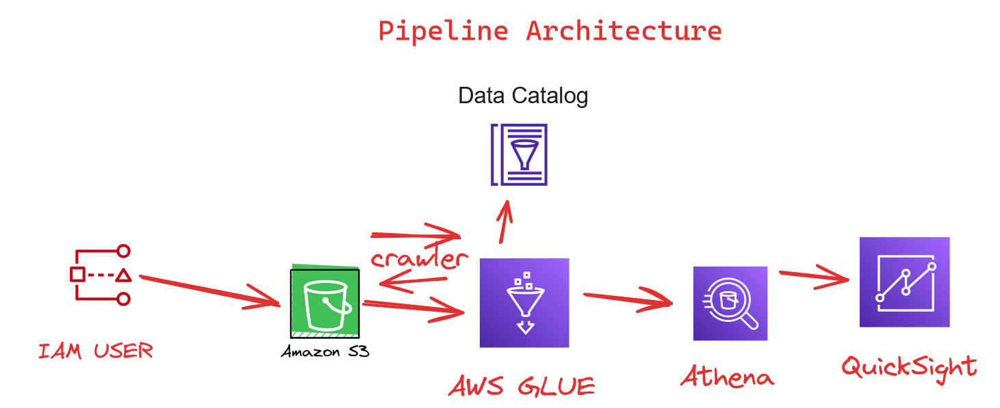

This Project is aimed to build a automated data ingestion pipeline using AWS Services.

Resources:
S3 Bucket

Services:
AWS Glue
AWS Athena
AWS QuickSight

Data used : Sample Superstore

Architecture type: Serverless

Why this way?
This hands on project,  gives understanding of commonly used services of Amazon Cloud ecosystem, through this project, users can have an understanding of
way policies, groups and governance works in AWS and also how services communicate with eachother. Before working on with this services, as a good practise I have created a IAM user. (if you are new to Amazon Web Services then note that AWS follows Principle of Least Privlige so you have to setup policies and assign roles)

AWS Glue is a powerful ETL service that makes it easy to prepare and load data. In this pipeline I am performing pull and load operations.
data is pulledfrom S3 bucket periodically, I have setup a crawler that does batch ingestion of data. The ingested data is loaded into a database which I am using to perform queries with AWS Athena and build a dashboard wiht Amazon Quick Sight.

