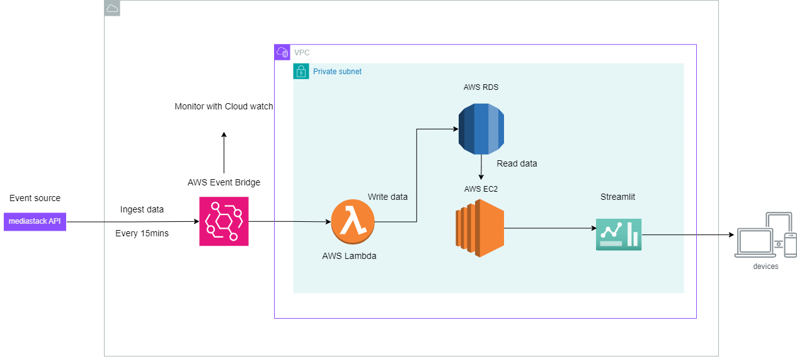

# Real-Time News Dashboard with AWS Cloud using Python Streamlit and MediaStack API

**Table of content:**
 - [Overview](#item-one)

 - [Services](#item-two)

 - [Services info](#item-three)

 - [Other info](#item-four)

 - [My Challenges and Learning](#item-five)

 - [Additional Reading](#item-six)

 - [Future Works](#item-seven)

## Overview
This project is a data engineering solution built on AWS, utilizing the MediaStack API for real-time news data extraction. I've developed a Python-based Lambda function, orchestrated by AWS EventBridge to trigger every 15 minutes, ensuring fresh data feeds. The project structure includes well-organized directories within the Lambda function to enhance maintainability and simulate a production environment. Key features include schema validation of the incoming data before storage in a PostgreSQL RDS instance, row count expectation checks to prevent empty data uploads, and exceptional handling with proper status codes.

## Services
**AWS Services:** Lambda, RDS (PostgreSQL), EventBridge, EC2, Cloudwatch.

**Programming:** Python.

**Libraries:** Streamlit for visualization, pandas for data manipulation.

**APIs:** MediaStack API for news data.

## Services info
**Lambda Function:** Manages data retrieval and processing logic, including schema validation and row count checks.

**EventBridge:** Triggers the Lambda function at 15-minute intervals.

**RDS (PostgreSQL):** Stores the data with schema constraints and versioning to distinguish between old and new data entries.

**EC2:** Hosts a Streamlit application that provides a user-friendly dashboard to display news data based on categories and refreshes in real-time.

## Other Info
Data Versioning: Implemented to handle multiple instances of data retrieval, marking new datasets distinctly.
Streamlit Dashboard: Features a dropdown for news categories and a three-column card view for news titles, with modals providing further details upon interaction.

## My Challenges and Learning
I encountered a variety of technical challenges that provided significant learning opportunities. One of the initial hurdles was configuring the AWS EC2 instance, which utilized a Linux image. Instead of the typical sudo apt update, I had to adapt to the environment by using sudo yum install to set up PostgreSQL, which was not readily available in AWS's default configuration.

Additionally, integrating PostgreSQL with the Lambda function presented its own set of challenges. AWS Lambda does not natively support psycopg2, a popular PostgreSQL adapter for Python. To overcome this, I implemented a custom Lambda layer provided by JetBridge, which is detailed in the project's issues log.

A major and complex issue was configuring the Virtual Private Cloud (VPC) to properly manage network settings for the Lambda function. AWS Lambda's default configuration does not support IPv6, which was necessary for making API requests. To resolve this, I developed an egress policy that allowed internet access, and I also had to set up IPv6 header blocks, assigning them to specific subnets and modifying route tables to ensure proper network traffic flow.

To monitor and optimize the performance of these solutions, I utilized AWS CloudWatch to create a custom dashboard. This tool was invaluable for tracking the runtime of triggers and ensuring that the system functioned as intended.

Through addressing these challenges, I gained a deeper understanding of AWS services, including intricacies in VPC configuration such as subnets, route tables, and NAT gateways. This project not only improved my technical prowess in managing real-time data and cloud resources but also enhanced my problem-solving skills in a complex cloud infrastructure environment.

## Additional Reading
please refere to issue_log txt file for reading links.

## Future Works
Trigger-based EC2 Activation: Modify the system to trigger the EC2 instance simultaneously with the Lambda function for more synchronized data updates.

Machine Learning Integration: Plan to utilize the stored data for NLP tasks, adding predictive analytics to the platform.